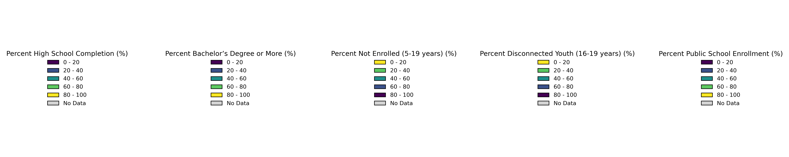

# Spatial Perspectives on Education in New Jersey
### Name: Shravani Kallur
### Command Line GIS - 34:816:651:90 | Taught by: Dr. Wenwen Zhang
### Edward J. Bloustein School of Planning and Public Policy

## About
This project aims to understand the broader spatial patterns of educational attainment, enrollment, and other relevant demographic or socio-economic indicators and explore the relationship between public school distribution and broader educational patterns in New Jersey. Research Questions:
What are the spatial patterns of educational attainment (e.g., high school and higher degrees) across counties and census tracts in New Jersey?
How do enrollment rates vary across census tracts and counties in New Jersey?
How does the distribution of public schools align with regions of high or low educational attainment and enrollment?
Are there regions with limited school access that also exhibit lower educational outcomes?

## Data Sources
1. Census data for educational attainment and school enrollment rates - American Community Survey, CensusAPI
2. Policy Map - Public Schools: Enrollment and Demographics (NCES) in New Jersey (State)
3. Census_Tracts_20202C_3424.geojson - NJGIN
4. NJ_Counties_NGJIN_2021.geojson - NJGIN

<section>
    <h2>Education Indicators by Census Tracts in New Jersey (2022) </h2>
    
The image below visualizes multiple indicators for education in New Jersey:

    
</section>

<section>
    <h2>Interactive Map</h2>
    
Explore the interactive map below:

    <iframe src="https://drive.google.com/uc?id=1XQMpsgVHlR2Exs2rvyRrreDlDSNPt4EO" 
            width="100%" 
            height="600px">
    </iframe>
</section>
You can explore [this map as its own web page here](https://drive.google.com/uc?id=1XQMpsgVHlR2Exs2rvyRrreDlDSNPt4EO)
<section>
    <h2>Legend</h2>
    
The legend for the education indicators is shown below:

    
</section>
